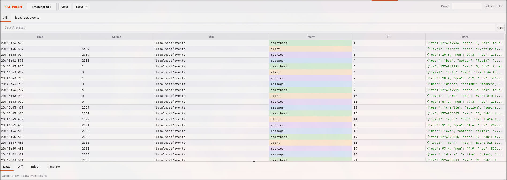

# SSE Parser, Burp Suite Extension

Intercept, inspect, modify, and inject Server-Sent Events live inside Burp Suite. Install once, browse normally, events appear automatically.



---

## How it works

Burp buffers HTTP responses before calling any extension callback. For SSE (a persistent connection that never closes) that callback never fires, so a normal extension approach cannot see events in real time.

SSE Parser works around this by running a small embedded relay server:

```
Browser -> Burp -> [relay on localhost:PORT]
                         |
                  real SSE server (original cookies and auth forwarded)
                         |
              events -> Burp -> Browser    (live stream intact)
                         |
                    SSE Parser tab
```

When intercept mode is on, the relay pauses at each event boundary and waits for you to Forward, modify, or Drop the event before the browser sees it.

---

## Features

| # | Feature | Where to find it |
|---|---------|-----------------|
| 1 | **Live intercept**, pause, edit, Forward or Drop each event | Intercept toggle in the toolbar, orange panel at the bottom |
| 2 | **Event injection**, push arbitrary events into any live stream | Inject tab in the detail pane |
| 3 | **Replay**, re-send any captured event to the browser | Right-click a row |
| 4 | **Send to Repeater**, synthetic POST with the event data pre-loaded | Right-click a row |
| 5 | **JSON auto-format**, pretty-prints JSON data fields | Data tab, always on |
| 6 | **Diff**, line-by-line +/- against the previous event of the same type | Diff tab |
| 7 | **Search**, one field that filters across URL, event, id, and data (regex supported) | Search bar above the table |
| 8 | **Export**, all captured events with full metadata | Export dropdown in the toolbar (JSON or CSV) |
| 9 | **Timing and rate**, delta-ms column plus a 60-second sparkline | Table column and Timeline tab |
| 10 | **Reconnect detection**, browser auto-reconnects flagged with a warm row tint | Automatic |
| 11 | **Event type coloring**, message / heartbeat / alert / metrics get distinct cell colors | Event column |
| 12 | **Multi-tab grouping**, one tab per endpoint plus an All tab | Auto-created on first event |
| 13 | **Upstream proxy**, route relay connections through a specific proxy | Proxy field in the toolbar |

---

## Install

**Requirements:** Burp Suite 2022.8 or newer, Java 17 or newer.

```bash
mvn package -q
# produces target/sse-parser-2.0.0.jar
```

In Burp: **Extensions, Installed, Add, Java, select the JAR.** The SSE Parser tab appears and the relay port is logged in the Output tab.

---

## Usage

Browse any SSE-enabled target. Requests carrying `Accept: text/event-stream` are handled automatically.

### Intercept
Click **Intercept OFF** to turn it on (button turns orange). Each incoming event pauses in the orange panel at the bottom. Edit freely, then:

- **Forward**, send the original event
- **Forward Modified**, send whatever is in the edit area
- **Drop**, discard the event (still recorded in the tab)

Toggle off to release all held events instantly.

### Search
The search bar matches case-insensitive substring across the URL, event type, id, and data fields all at once. If your text parses as a regex, it is also applied, so `^error` or `user.*bob` works.

### Detail tabs
Select any row in the table, then use the tabs at the bottom:

- **Data**, pretty-printed JSON of the selected event
- **Diff**, +/- diff against the previous event of the same type
- **Inject**, send your own event into the live stream for this URL
- **Timeline**, 60-second event-rate chart

### Replay
Right-click any row, **Replay to browser**, re-sends the stored event to the current open stream for that URL.

### Send to Repeater
Right-click any row, **Send to Repeater**, opens a synthetic `POST /sse-event` in Burp Repeater with the event body pre-loaded and `X-SSE-Event`, `X-SSE-ID`, `X-SSE-URL`, `X-SSE-Seq` headers set.

### Upstream proxy
Type `host:port` in the Proxy field in the toolbar and press Enter. Leave blank and press Enter to go direct.

---

## Testing locally

A small Python SSE server is included for quick testing:

```bash
python3 sse_test_server.py
# serves HTML + SSE at http://localhost:7788
```

Point a Burp-proxied browser at `http://localhost:7788` and events start flowing into the extension tab.

---

## Notes

- The relay binds to `localhost` only, nothing on the network can reach it directly.
- SSE requests appear in Burp's HTTP history going to `localhost:PORT`. The original endpoint URL is written into the Notes column of each entry.
- The relay accepts any TLS certificate from the upstream server. This is intentional so the extension works against targets with self-signed certs or Burp-reissued certs.
