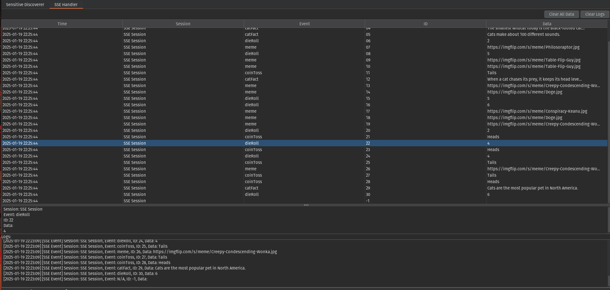

# SSE_Parser - A Burp Suite Extension

This extension partially handles **Server-Sent Events (SSE)** within Burp Suite by intercepting HTTP responses at the **Extension** → **Installed** sub-tab (after you've configured the Python environment under **Extension** → **Settings**). It cannot capture raw TCP chunks in real time (due to limitations in Burp’s Extender / Montoya APIs), but it can parse chunked SSE data that Burp has already buffered. 

## Features

- **Near real-time SSE parsing**: Discovers `event: data:` lines from chunked SSE.
- **Table view**: Displays captured events (time, session, event, ID, data).
- **Logs & controls**: Clear logs, clear table data, and see SSE debug info.

## Installation Instructions

1. **Burp Suite** → **Extensions** → **Extensions Settings**:
   - Scroll down to “Python Environment.”
   - Set “Location of Jython standalone JAR” to your .

2. **Burp Suite** → **Extension** → **Installed**:
   - Click “Add.”
   - Choose “Extension Type” = **Python**.
   - Select `sse_parser.py` (this extension’s file).
   - Click “Next” / “Ok.”

3. You should see **SSE_Parser** as a new tab in the main Burp interface once it loads successfully.

   
   
## Usage

1. **Proxy** your SSE traffic through Burp.  
2. **Check** the **SSE_Parser** tab for any recognized SSE data:
   - SSE events populate in the table.
   - Selecting a row shows the full details in the text area.
3. **Click** “Clear All Data” to remove table entries and event details.
4. **Click** “Clear Logs” to wipe the logs panel.

## Known Limitations

- **Chunk-Based**: We only see SSE data after Burp receives each chunk. True per-line streaming isn't possible.
- **No Raw TCP**: Burp doesn't expose a raw data-level intercept, so partial lines are still delayed.
- **Large Streams**: SSE streams that run forever won't break Burp, but they can fill the logs and table quickly. Consider forcibly dropping the connection if it’s too large.

## Why Can't It Capture True Real-Time Data?

**Important**: Burp’s Extender API and Montoya API **do not** provide a low-level or raw TCP hook for unbuffered chunks. Therefore, we cannot truly stream SSE data one line at a time in real time. By the time our extension code runs, Burp has already buffered large chunks. 

### If You Really Need True Streaming
You must set up a **mini proxy** like mitm or something like that *in front* of Burp that directly intercepts raw TCP data, so it can forward SSE lines as they arrive. However, this partially defeats the purpose of using Burp to capture SSE in real time, because **Burp** is then no longer the direct SSE proxy.
